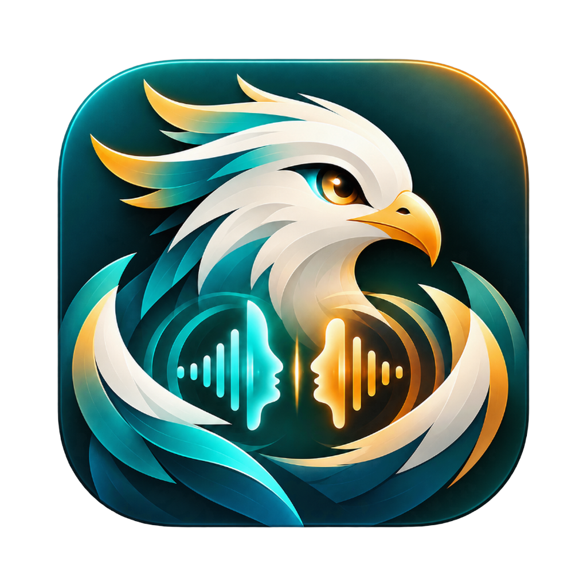

<div align="center">



# 鲲鹏有声 · Kunpeng Voice

**录 10 秒，用你的声音读出任何文字。**

原生 macOS 声音克隆应用 · 完全本地运行 · 音频不上传

[官网](https://voice.kunpeng.si) · [下载](https://github.com/wyq09/kunpeng-voice/releases/latest) · [问题反馈](https://github.com/wyq09/kunpeng-voice/issues)


[](https://github.com/wyq09/kunpeng-voice/actions/workflows/build.yml)


</div>

---

## 特性

- **零样本克隆**：念一段 10 秒左右的文字（或拖入一段音频），立刻得到一个属于你的声音
- **15 种情绪与场景**：自然、温柔、开心、生气、悲伤、播音、讲故事、耳语……文字里写 `[生气]我真的生气了。[平静]算了。` 就能逐段切换
- **长文一次成型**：按句读智能分段，自动检测音色漂移并重生成，长文本也保持同一个声音
- **多模型可选**：CosyVoice 3、VoxCPM 2 / 1.5、Qwen3-TTS，按需下载、断点续传，国内自动切换镜像
- **智能断句（可选）**：接入 DeepSeek / 通义 / 智谱等 OpenAI 兼容接口，让朗读停顿更自然
- **接入 AI Agent**：内置 MCP 服务器与命令行，Claude Code、Cursor、Codex 都能直接“用你的声音说话”
- **隐私优先**：推理全部在本机 Apple Silicon 上完成，录音和生成结果只保存在你的 Mac 上

## 安装

1. 从 [Releases](https://github.com/wyq09/kunpeng-voice/releases/latest) 下载 `KunpengVoice-macOS.dmg`，把「鲲鹏有声」拖进「应用程序」
2. 应用未经 Apple 公证，首次打开前在终端执行一次：

   ```bash
   xattr -dr com.apple.quarantine /Applications/鲲鹏有声.app
   ```

3. 打开应用，按提示下载模型（默认 CosyVoice 3，约 1.6 GB，仅需一次）

**系统要求**：macOS 15 及以上，Apple Silicon（M1 及更新），建议 16 GB 内存。

## 使用

1. **创建声音**：照着屏幕上的文字念一遍，或拖入一段 WAV / MP3 / M4A
2. **输入文字**：选择情绪和语速，或在文字中插入 `[情绪]` 标签
3. **生成并导出**：试听满意后导出 WAV

## 接入 Agent（MCP / 命令行）

应用左下角「接入 Agent」提供一键配置。也可以手动添加：

```bash
# Claude Code
claude mcp add clonevoice --scope user -- "/Applications/鲲鹏有声.app/Contents/MacOS/CloneVoice" mcp

# Codex
codex mcp add clonevoice -- "/Applications/鲲鹏有声.app/Contents/MacOS/CloneVoice" mcp
```

Cursor 等其他客户端在 `mcp.json` 中加入：

```json
{
  "mcpServers": {
    "clonevoice": {
      "command": "/Applications/鲲鹏有声.app/Contents/MacOS/CloneVoice",
      "args": ["mcp"]
    }
  }
}
```

命令行（在应用内「安装命令」后可直接用 `clonevoice`）：

```bash
clonevoice voices
clonevoice speak "[开心]你好呀！[平静]今天过得怎么样？" --play
clonevoice speak "欢迎收听" --voice 小明 --style 播音 --out ~/Desktop/intro.wav
```

## 从源码构建

需要 Xcode 26 及以上（Swift 6.2）。MLX 的 Metal 着色器必须用 `xcodebuild` 编译，`swift build` 不行。

```bash
xcodebuild -downloadComponent MetalToolchain   # 仅首次
./build.sh                                      # 产物：build/鲲鹏有声.app
open build/鲲鹏有声.app
```

推送 `v*` 标签会触发 GitHub Actions 自动构建，并把 `.dmg` 发布到 Releases：

```bash
git tag v1.0.0 && git push origin v1.0.0
```

## 支持的模型

| 模型 | 特点 | 大小 |
| --- | --- | --- |
| CosyVoice 3（推荐） | 情绪指令真正生效，中文自然 | 1.6 GB |
| CosyVoice 3 轻量版 | 4bit 量化，更小更快 | 1.3 GB |
| VoxCPM 2 | 48 kHz 高保真，支持风格描述 | 2.3 GB |
| VoxCPM 1.5 | 44.1 kHz，体积小 | 1.0 GB |
| Qwen3-TTS 1.7B | 音色还原度高 | 3.1 GB |
| Qwen3-TTS 0.6B | 生成更快 | 2.0 GB |

## 数据位置

所有数据都在 `~/Library/Application Support/CloneVoice/`：

- `voices.json`：声音库与生成记录
- `*.wav`：声音样本与生成的音频
- `Models/`：模型权重
- `polisher.json`：智能断句的接口配置（含你填写的 API Key，仅存本机）

## 项目结构

```
Sources/CloneVoice/
├── Views/     SwiftUI 界面
├── Engine/    推理后端（CosyVoice / VoxCPM / Qwen3）、模型下载、智能断句
├── Audio/     录音、播放、转写、音高检测、响度处理
├── Stores/    声音库与生成任务
├── Agent/     MCP 服务器与命令行
└── Models/    数据模型与模型目录
Vendor/SpeechSwift/   CosyVoice 与 VoxCPM 的 MLX 实现（Apache-2.0）
```

## 致谢

- [mlx-audio-swift](https://github.com/Blaizzy/mlx-audio-swift)、[mlx-swift](https://github.com/ml-explore/mlx-swift)
- [CosyVoice](https://github.com/FunAudioLLM/CosyVoice)、[VoxCPM](https://github.com/OpenBMB/VoxCPM)、[Qwen3-TTS](https://github.com/QwenLM)
- [swift-huggingface](https://github.com/huggingface/swift-huggingface)

## 使用须知

请只克隆你本人或已获授权的声音，不要将生成的音频用于冒充他人、诈骗或其他违法用途。

## 许可证

[Apache-2.0](LICENSE)
